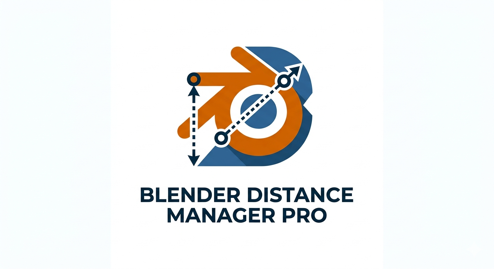

# Blender Distance Manager Pro 🚀

**Blender Distance Manager Pro** — це безкоштовний аддон для Blender, розроблений для повної автоматизації процесу створення масок дистанції через систему **Dynamic Paint**. 

Замість десятків ручних кліків для налаштування Canvas, Brush та Bake, цей інструмент дозволяє згенерувати карту дистанції (Proximity Map) за лічені секунди.

---

## 📸 Screen
![Blender Distance Manager Panel]

  

## ✨ Основні можливості (Features)

* **One-Click Setup:** Автоматичне додавання модифікаторів Dynamic Paint, налаштування білого фону для Canvas та режиму дистанції для Brush.
* **Collection Support:** Можливість використовувати цілі колекції об'єктів як "пензлі" з можливістю масового налаштування радіусу дистанції.
* **Smart Bake:** Аддон автоматично підлаштовує діапазон кадрів симуляції під поточний кадр таймлайну, щоб уникнути помилок запікання.
* **Auto-Shader Link:** Автоматичне створення `Image Texture` ноди в матеріалі та підключення її до `Principled BSDF` (Base Color).
* **Fail-Safe Logic:** Вбудований захист від помилок `NoneType` та автоматичне створення папок для кешу.

---

## 🛠 Встановлення (Installation)

1. Завантажте файл `blender_distance_manager.py`.
2. Відкрийте Blender: **Edit > Preferences > Add-ons**.
3. Натисніть **Install...** та виберіть завантажений файл.
4. Активуйте аддон, поставивши галочку біля **Object: Blender Distance Manager Pro**.
5. *Рекомендовано:* Для стабільної роботи збережіть налаштування (**Save Preferences**).

---

## 📖 Як користуватися (Usage)

1. **Вибір цілей:**
   - В полі **Canvas** виберіть об'єкт, на якому буде малюватися маска.
   - В полі **Brush** виберіть об'єкт-пензель АБО вкажіть **Coll** (колекцію), якщо пензлів багато.
2. **Ініціалізація:** Натисніть **Initialize / Reset System**. Скрипт налаштує всі модифікатори та створить шлях для збереження текстур.
3. **Налаштування:** Виставте потрібний **Distance** (радіус). Якщо використовуєте колекцію — натисніть **Apply All**.
4. **Запікання:** Натисніть **1. BAKE**. В папці з вашим `.blend` файлом з'явиться папка `Blender_Bake_Cache` з готовою PNG-маскою.
5. **Оновлення:** Натисніть **2. RECONNECT & REFRESH**. Матеріал об'єкта автоматично оновиться, і ви побачите результат у в'юпорті (режим Material Preview/Render).

---

## ⚠️ Важливі зауваження

* **UV Map:** Об'єкт-Canvas обов'язково повинен мати розгортку (UV Map).
* **Збереження файлу:** Перед початком роботи збережіть ваш `.blend` файл, щоб аддон міг створити папку для кешу текстур поруч із ним.
* **Версія Blender:** Тестовано на версіях 3.0, 3.6 та 4.x.

---

## 📜 Ліцензія (License)

Цей аддон розповсюджується під ліцензією **MIT**. Ви можете вільно використовувати, змінювати та поширювати його як у некомерційних, так і в комерційних проектах.

---

**Розроблено за допомогою Gemini AI для спільноти Blender.** 🧡
